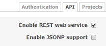
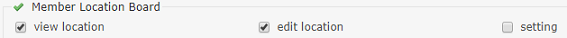

# Redmine member location board plugin

This plugin provides the member location board.

## Main features
* Display project member location
* (optional) Display background color
* (optional) Display feeling image

# Screenshots
#### Overview

#### Plugin Setting

# Installation notes

## Install

1. go to plugins folder
<pre>
git clone https://github.com/aki360P/redmine_member_location_board.git
</pre>
2. bundle install or change source code
<pre>
bundle install
</pre>
3. migration
<pre>
rake redmine:plugins:migrate NAME=redmine_member_location_board RAILS_ENV=production
</pre>
4. restart server
5. enable RestAPI

6. permission

### How to skip bundle install(change source code)

* delete Gemfile in ./plugins/redmine_member_location_board
* change source code 001_create_table.rb in ./plugins/redmine_member_location_board/db/migrate.
 First line needs to be changed according to your rails version
<pre>
 class CreateTable < ActiveRecord::CompatibleLegacyMigration.migration_class
  #for redmine 3x,  class CreateTable < ActiveRecord::Migration
  #for redmine 4x,  class CreateTable < ActiveRecord::Migration[4.2]
</pre>

### How to add feeling images

You can add face images into assets\images\* directory.
Image shall be 5 data each and named with 5.png, ... 1.png.
And restart server.

Enjoy new function!

## UnInstall

<pre>
rake redmine:plugins:migrate NAME=redmine_member_location_board VERSION=0 RAILS_ENV=production
</pre>
