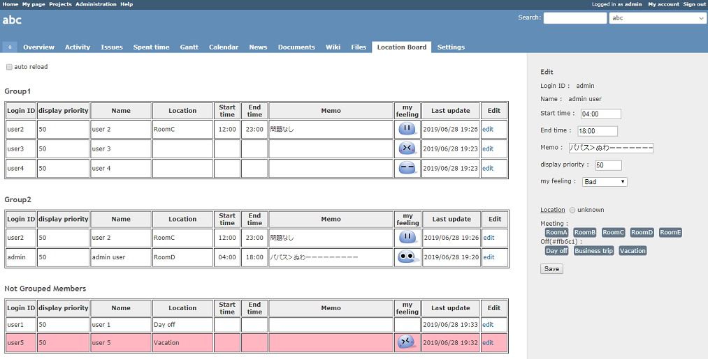
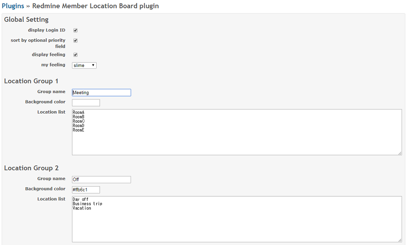

# Redmine member location board plugin

This plugin provides the member location board.

#### Main features
* Display project member location
* (optional) Show login ID
* (optional) Sort manually
* (optional) Display background color

## Installation notes
#### Install
1. go to plugins folder
git clone ttps://github.com/aki360P/redmine_member_location_board.git
2. bundle install or change source code
bundle install
3. migration
rake redmine:plugins:migrate NAME=redmine_member_location_board RAILS_ENV=production
4. restart server

Skip bundle install(change source code)
delete Gemfile in ./plugins/redmine_member_location_board
change source code 001_create_table.rb in ./plugins/redmine_member_location_board/db/migrate
 class CreateTable < ActiveRecord::CompatibleLegacyMigration.migration_class
  #for redmine 3x,  class CreateTable < ActiveRecord::Migration
  #for redmine 4x,  class CreateTable < ActiveRecord::Migration[4.2]
First line needs to be changed according to your rails version

#### UnInstall
rake redmine:plugins:migrate NAME=redmine_member_location_board VERSION=0 RAILS_ENV=production

# Screen shots
#### Overview

#### Plugin Setting

